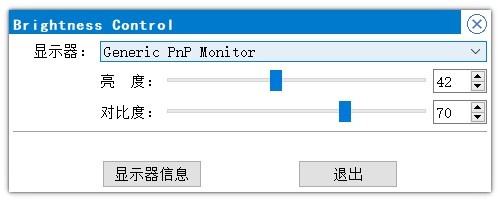
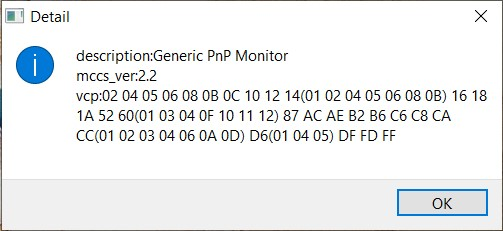

# Brightness Control

## Introduction

When you bought a monitor, there are some related drivers and software you can install. So you can enable some montior's features or adjust some parameters of display get you out of the physical buttons, such as brightness, contrast, etc.

I have more than one monitor in my workplace and my home, and they come from different brands. Unfortunately, some of them have no official software, so I have to press the buttons on display, despite all supporting DDC/CI. Considering that software comes from an unknown website is usually unsafe, so I wrote my tool using Python programming language.

## Implementation

Python is pretty easy to use, even though C/C++ is my primary language. Python with the ctypes module can conveniently access the C libraries, so it can invoke Windows API directly. 

DDC/CI is a protocol between host and monitor, making it possible to customize your display settings by software. Detail document about DDC/CI can be found in [doc/mccs.pdf](doc/mccs.pdf). Windows also provide the interface to control it, the document can be found at [Using the High-Level Monitor Configuration Functions](https://docs.microsoft.com/en-us/windows/win32/monitor/using-the-high-level-monitor-configuration-functions), and of course, there are low-level functions as well.

Based on this, the app's interface, as shown below.

Select the monitor you want to adjust and drag the slider. 

This app also has a system tray icon, and the Exit button can actually exit from this app, the X button is just hidden it.

As you see, the brightness, contrast(VCP code is 10 and 12) is the only settings that can be adjusted. Because this settings are used most often. Many other configurations are not yet implemented. All the supported settings(VCP codes) can be seen in the monitor detail button, as shown below.

